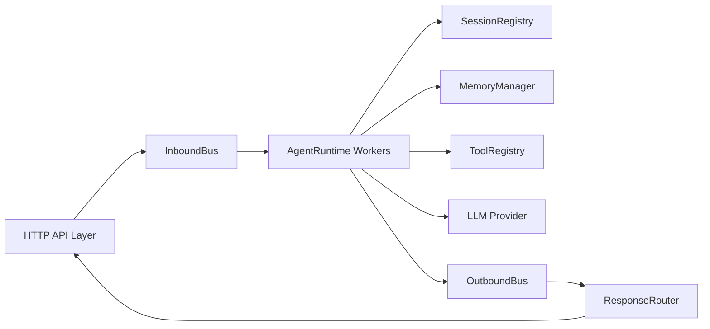

# C++ Multi-Session Agent Design

## 1. Project Goal

This project is a general-purpose conversational agent backend built on top of a custom C++ web framework.

The system is designed for a single personal user, but it must support:

1. Multiple independent chat sessions
2. Short-term session memory
3. Long-term summary memory
4. Retrievable memory
5. Tool calling
6. OpenAI-compatible LLM provider
7. Synchronous HTTP API

The core of the project is not the HTTP layer itself, but an **Agent Runtime driven by an asynchronous message bus**.

---

## 2. Core Design Principles

### 2.1 Session is a state object, not a worker thread

A `Session` represents a conversation context and its memory state.

A session stores:

1. Message history
2. Summary memory
3. Retrievable memory metadata
4. Runtime status metadata

A session does **not** own an internal processing thread.

This is a deliberate choice to avoid a double-runtime design.

### 2.2 AgentRuntime is the only execution runtime

All message processing happens inside `AgentRuntime` workers.

`Session` does not execute model inference, does not run its own event loop, and does not call tools directly.

This ensures:

1. A single source of truth for execution flow
2. Clear separation between state and behavior
3. Easier debugging and scheduling

### 2.3 Bus is the backbone of the system

The system is organized around two asynchronous channels:

1. `InboundBus`
2. `OutboundBus`

All external requests enter the system through `InboundBus`.
All completed agent responses leave the core through `OutboundBus`.

This keeps the HTTP layer decoupled from the agent processing core.

### 2.4 Session-level serialization, cross-session concurrency

The system must support multiple sessions in parallel.

However, messages inside the same session must be processed serially.

That means:

1. Different sessions may run concurrently
2. The same session must never be processed concurrently

This avoids context corruption and memory race conditions.

### 2.5 Memory is file-backed through a dedicated manager

Memory is not embedded directly into `Session` logic.

Instead, a dedicated `MemoryManager` is responsible for:

1. Loading memory from local files
2. Updating memory state
3. Persisting memory through the tool layer

The `write_file` tool is reused as the unified file-writing mechanism.

---

## 3. High-Level Architecture



### Responsibilities

#### HTTP API Layer

1. Receives HTTP requests
2. Creates `InboundMessage`
3. Registers pending request with `ResponseRouter`
4. Pushes message into `InboundBus`
5. Waits for the matching response future
6. Returns HTTP response

#### AgentRuntime

1. Consumes `InboundMessage`
2. Locks target session
3. Loads session state and memory
4. Builds prompt
5. Executes the agent loop
6. Updates memory
7. Emits `OutboundMessage`

#### ResponseRouter

1. Maps `message_id` to a waiting promise/future
2. Consumes `OutboundMessage`
3. Delivers the correct response to the correct waiting HTTP request

This component is required because HTTP is synchronous while the core runtime is asynchronous.

---

## 4. Data Structures

### 4.1 InboundMessage

```cpp
struct InboundMessage {
    std::string message_id;
    std::string session_id;
    std::string content;
    int64_t timestamp;
    Json::Value metadata;
};
```

### 4.2 OutboundMessage

```cpp
struct OutboundMessage {
    std::string message_id;
    std::string session_id;
    std::string content;
    Json::Value tool_calls;
    bool success = true;
    std::string error_msg;
    Json::Value metadata;
};
```

### 4.3 ChatMessage

This is the canonical message unit stored in short-term memory.

```cpp
struct ChatMessage {
    std::string role;       // user / assistant / tool / system
    std::string content;
    int64_t timestamp;
    Json::Value metadata;
};
```

### 4.4 MemoryRecord

```cpp
struct MemoryRecord {
    std::string type;   // fact / decision / preference
    std::string text;
    std::vector<std::string> tags;
    int64_t timestamp;
};
```

---

## 5. Runtime Model

## 5.1 Why Session must not own a thread

The previous design had two execution centers:

1. `AgentWorker` consuming `InboundBus`
2. `Session` also owning a thread and queue

That design creates ambiguity:

1. Where does prompt building happen
2. Where does tool calling happen
3. Where does memory update happen
4. Which layer is the real runtime

To eliminate that conflict, this design uses:

1. `Session` as a pure state container
2. `AgentRuntime` as the only execution runtime

## 5.2 Session serialization model

Each session owns a lightweight mutex or execution guard:

```cpp
class Session {
public:
    explicit Session(std::string id);

    const std::string& GetId() const;
    int64_t GetCreatedAt() const;
    int64_t GetUpdatedAt() const;

    std::vector<ChatMessage>& Messages();
    const std::vector<ChatMessage>& Messages() const;

    std::mutex& ExecutionMutex();

    void Touch();

private:
    std::string id_;
    int64_t created_at_;
    int64_t updated_at_;
    std::vector<ChatMessage> messages_;
    std::mutex execution_mtx_;
};
```

Processing rule:

1. `AgentRuntime` receives a message
2. Looks up the session
3. Acquires the session execution lock
4. Processes the whole turn
5. Releases the lock

This guarantees per-session ordering without embedding threads inside session objects.

---

## 6. Core Modules

## 6.1 BusChannel

The bus provides bounded asynchronous channels.

```cpp
template<typename T>
class BusChannel {
public:
    using Sender = std::shared_ptr<ChannelSender<T>>;
    using Receiver = std::shared_ptr<ChannelReceiver<T>>;

    static std::pair<Sender, Receiver> Create(size_t capacity = 1024);
};
```

### Requirements

1. Multi-producer safe
2. Multi-consumer safe
3. Blocking receive with cancellation
4. Bounded capacity
5. Close semantics

### Channel usage

```cpp
using InboundBus = BusChannel<InboundMessage>;
using OutboundBus = BusChannel<OutboundMessage>;
```

---

## 6.2 SessionRegistry

`SessionRegistry` is the owner of sessions.

It must use `shared_ptr`, not `weak_ptr`, because sessions are long-lived stateful runtime objects.

```cpp
class SessionRegistry {
public:
    static SessionRegistry& Instance();

    std::shared_ptr<Session> Create();
    std::shared_ptr<Session> Get(const std::string& id);
    bool Remove(const std::string& id);
    std::vector<std::string> List() const;

private:
    std::unordered_map<std::string, std::shared_ptr<Session>> sessions_;
    mutable std::shared_mutex mtx_;
    std::atomic<uint64_t> counter_{0};
};
```

### Responsibilities

1. Create sessions
2. Store sessions
3. Return existing sessions
4. Delete sessions explicitly

This matches the product requirement: conversations stay alive until removed.

---

## 6.3 ResponseRouter

This module solves the sync HTTP plus async runtime bridge problem.

### Problem

If the HTTP layer directly waits on `OutboundBus`, concurrent requests can consume each other's responses.

### Solution

Use a response routing table keyed by `message_id`.

```cpp
class ResponseRouter {
public:
    std::future<OutboundMessage> Register(const std::string& message_id);
    void Fulfill(OutboundMessage msg);
    void Fail(const std::string& message_id, const std::string& error);

private:
    std::unordered_map<std::string, std::promise<OutboundMessage>> pending_;
    std::mutex mtx_;
};
```

### Flow

1. HTTP receives `/chat`
2. Generates `message_id`
3. Calls `router.Register(message_id)`
4. Pushes inbound message
5. Waits on returned future
6. `ResponseRouter` fulfills only the matching future when response arrives

This is mandatory for correctness.

---

## 6.4 MemoryManager

`MemoryManager` is responsible for all memory loading, transformation, and persistence.

It is a dedicated module and must not be merged into `Session`.

### Responsibilities

1. Load short-term memory from session state
2. Load long-term summary from file
3. Load retrievable memory from file
4. Decide when summary update is needed
5. Decide what memories to extract
6. Persist summary and retrieval memory through `write_file`

### Memory file layout

Each session has its own memory directory:

```text
memory/
  sessions/
    sess_001/
      messages.jsonl
      summary.md
      retrieval.jsonl
```

### Public API sketch

```cpp
class MemoryManager {
public:
    struct LoadedMemory {
        std::vector<ChatMessage> short_term;
        std::string summary;
        std::vector<MemoryRecord> retrieved;
    };

    LoadedMemory LoadForPrompt(const Session& session, const std::string& current_input);

    void PersistTurn(
        Session& session,
        const ChatMessage& user_msg,
        const ChatMessage& assistant_msg);

    void MaybeUpdateSummary(Session& session, IToolRegistry& tools, ILLMProvider& llm);
    void MaybeExtractRetrievalMemory(Session& session, IToolRegistry& tools);
};
```

### Important rule

Memory files are written through the tool layer, not by ad hoc file writes scattered across the codebase.

That means:

1. `MemoryManager` decides what to write
2. `ToolRegistry` executes `write_file`
3. `WriteFileTool` performs the actual file write

This keeps file persistence behavior unified.

---

## 6.5 Tool System

The first version includes only:

1. `read_file`
2. `write_file`

### Tool interface

```cpp
struct ToolResult {
    bool success;
    std::string content;
    std::string error_msg;
};

class ITool {
public:
    virtual ~ITool() = default;
    virtual std::string Name() const = 0;
    virtual Json::Value Schema() const = 0;
    virtual ToolResult Execute(const Json::Value& args) = 0;
};
```

### ToolRegistry

```cpp
class IToolRegistry {
public:
    virtual ~IToolRegistry() = default;
    virtual void Register(std::unique_ptr<ITool> tool) = 0;
    virtual Json::Value GetSchemas() const = 0;
    virtual ToolResult Execute(const std::string& name, const Json::Value& args) = 0;
};
```

### Tool roles in the system

Tools serve two purposes:

1. User-task execution
2. Internal system support, especially memory persistence

So `write_file` is not only a user-facing capability. It is also infrastructure for memory storage.

---

## 6.6 LLM Provider

The first provider is OpenAI-compatible HTTP.

```cpp
struct ToolCall {
    std::string id;
    std::string name;
    Json::Value arguments;
};

struct LLMMessage {
    std::string role;
    std::string content;
};

struct LLMRequest {
    std::string model;
    std::vector<LLMMessage> messages;
    Json::Value tools;
    int max_tokens = 4096;
    float temperature = 0.7f;
};

struct LLMResponse {
    bool success = true;
    std::string content;
    std::vector<ToolCall> tool_calls;
    std::string finish_reason;
    std::string error_msg;
};

class ILLMProvider {
public:
    virtual ~ILLMProvider() = default;
    virtual LLMResponse Chat(const LLMRequest& request) = 0;
};
```

---

## 6.7 AgentRuntime

`AgentRuntime` is the only processing engine in the system.

```cpp
class AgentRuntime {
public:
    static AgentRuntime& Instance();

    void Initialize(Config config);
    void Start(size_t worker_count = 2);
    void Stop();

    InboundBus::Sender GetInboundSender();

private:
    void WorkerLoop(std::stop_token st);
    OutboundMessage ProcessMessage(const InboundMessage& msg);
    std::string RunAgentLoop(
        Session& session,
        const MemoryManager::LoadedMemory& memory,
        const std::string& user_input);

    Config config_;
    std::vector<std::jthread> workers_;
    std::stop_source stop_source_;

    InboundBus::Sender inbound_sender_;
    InboundBus::Receiver inbound_receiver_;
    OutboundBus::Sender outbound_sender_;
};
```

### WorkerLoop behavior

1. Receive inbound message
2. Lookup session
3. Acquire session lock
4. Load memory
5. Execute agent loop
6. Persist memory updates
7. Send outbound message

---

## 7. Prompt Construction

The prompt must include three memory layers:

1. Recent short-term conversation
2. Long-term summary
3. Retrieved relevant memories

### Corrected prompt builder signature

The previous design omitted retrieved memory from prompt construction.

It should be:

```cpp
std::string BuildPrompt(
    const std::vector<ChatMessage>& short_term,
    const std::string& summary,
    const std::vector<MemoryRecord>& retrieved,
    const std::string& current_input);
```

### Prompt structure

```text
[System]
You are a multi-session C++ conversational agent with memory and tools.

[Long-Term Summary]
...

[Retrieved Memory]
- ...
- ...

[Recent Conversation]
User: ...
Assistant: ...

[Current User Input]
...
```

---

## 8. End-to-End Flow

## 8.1 Startup

```text
main()
  -> SessionRegistry init
  -> ResponseRouter init
  -> AgentRuntime::Initialize()
  -> create InboundBus / OutboundBus
  -> AgentRuntime::Start(worker_count)
  -> start OutboundBus consumer -> ResponseRouter::Fulfill(...)
  -> start HTTP server
```

## 8.2 Create Session

```text
POST /sessions
  -> SessionRegistry::Create()
  -> return session_id
```

## 8.3 Send Chat Message

```text
POST /chat
  -> generate message_id
  -> ResponseRouter.Register(message_id)
  -> build InboundMessage
  -> InboundBus.Send(msg)
  -> wait on future(message_id)
  -> return matched OutboundMessage
```

## 8.4 Internal Agent Processing

```text
AgentRuntime worker
  -> Receive InboundMessage
  -> SessionRegistry.Get(session_id)
  -> lock session.ExecutionMutex()
  -> MemoryManager.LoadForPrompt(...)
  -> BuildPrompt(...)
  -> AgentLoop(...)
  -> MemoryManager.PersistTurn(...)
  -> OutboundBus.Send(response)
```

## 8.5 Tool Loop

```text
AgentLoop
  -> LLMProvider.Chat(request)
  -> if tool_calls returned
       -> ToolRegistry.Execute(...)
       -> append tool result to messages
       -> continue loop
  -> else
       -> final response
```

---

## 9. HTTP API

## 9.1 Create Session

```http
POST /sessions
```

Response:

```json
{
  "session_id": "sess_001",
  "created_at": 1710000000
}
```

## 9.2 Chat

```http
POST /chat
```

Request:

```json
{
  "session_id": "sess_001",
  "message": "hello"
}
```

Response:

```json
{
  "message_id": "msg_001",
  "session_id": "sess_001",
  "reply": "hello, how can I help?",
  "tool_calls": [],
  "success": true
}
```

## 9.3 Get Session

```http
GET /sessions/{session_id}
```

## 9.4 Get Messages

```http
GET /sessions/{session_id}/messages?limit=20
```

## 9.5 Delete Session

```http
DELETE /sessions/{session_id}
```

---

## 10. Directory Layout

```text
agent/
├── DESIGN.md
├── include/
│   ├── bus/
│   │   ├── BusChannel.h
│   │   ├── InboundMessage.h
│   │   └── OutboundMessage.h
│   ├── session/
│   │   ├── Session.h
│   │   └── SessionRegistry.h
│   ├── memory/
│   │   ├── ChatMessage.h
│   │   ├── MemoryRecord.h
│   │   └── MemoryManager.h
│   ├── router/
│   │   └── ResponseRouter.h
│   ├── agent/
│   │   ├── AgentRuntime.h
│   │   └── AgentConfig.h
│   ├── tool/
│   │   ├── ITool.h
│   │   ├── ToolRegistry.h
│   │   ├── ReadFileTool.h
│   │   └── WriteFileTool.h
│   ├── llm/
│   │   ├── ILLMProvider.h
│   │   ├── OpenAIProvider.h
│   │   └── LLMTypes.h
│   └── api/
│       ├── ChatHandler.h
│       └── SessionHandler.h
├── src/
│   ├── bus/
│   ├── session/
│   ├── memory/
│   ├── router/
│   ├── agent/
│   ├── tool/
│   ├── llm/
│   └── api/
├── memory/
│   └── sessions/
├── tests/
└── config/
    └── agent.yaml
```

---

## 11. Implementation Phases

### Phase 1: Runtime Skeleton

1. `BusChannel`
2. `ResponseRouter`
3. `Session`
4. `SessionRegistry`
5. Basic HTTP API

### Phase 2: Agent Core

1. `AgentRuntime`
2. `OpenAIProvider`
3. Session-level execution lock
4. Short-term memory

### Phase 3: Tool Loop

1. `ToolRegistry`
2. `ReadFileTool`
3. `WriteFileTool`
4. Agent tool-call loop

### Phase 4: Memory System

1. `MemoryManager`
2. Summary generation
3. Retrieval memory extraction
4. File-backed memory persistence through `write_file`

---

## 12. Key Decisions

1. **Session is state, not runtime**
   This removes the double-scheduler problem.

2. **AgentRuntime is the only processing engine**
   All inference, tool execution, and memory updates happen here.

3. **ResponseRouter is required**
   Sync HTTP cannot safely consume a shared outbound queue directly.

4. **SessionRegistry owns sessions strongly**
   Sessions are long-lived conversation objects, not temporary weak references.

5. **MemoryManager is independent**
   Memory is complex enough to deserve its own module.

6. **Memory persistence goes through `write_file`**
   This keeps file writes unified through the tool layer.

7. **Same-session serialization is mandatory**
   Different sessions may run concurrently, but one session must never process two turns at once.

